# 🛍️ EasyShop – End-to-End DevSecOps & GitOps E-Commerce Platform on AWS EKS

<p align="center">


</p>

<p align="center">

### 🚀 Production-Grade DevSecOps • GitOps • Kubernetes • AWS Cloud

</p>

---

## 📌 Project Overview

**EasyShop** is a full-stack e-commerce application deployed on **AWS EKS** using an automated **DevSecOps and GitOps workflow**.

The project demonstrates how a containerized application can move from source code to a Kubernetes production-style environment using:

* Infrastructure as Code with **Terraform**
* Containerization with **Docker**
* Continuous Integration with **Jenkins**
* Security scanning with **Trivy**
* Container image publishing to **Docker Hub**
* Kubernetes orchestration with **Amazon EKS**
* GitOps-based deployment using **Argo CD**
* NGINX Ingress for external traffic
* Let's Encrypt for HTTPS
* Horizontal Pod Autoscaling
* Prometheus and Grafana for monitoring and observability

The application consists of a **Next.js / TypeScript frontend and backend** with **MongoDB** as the database.

---

# 🏗️ Architecture

## EasyShop – End-to-End DevSecOps & GitOps Architecture

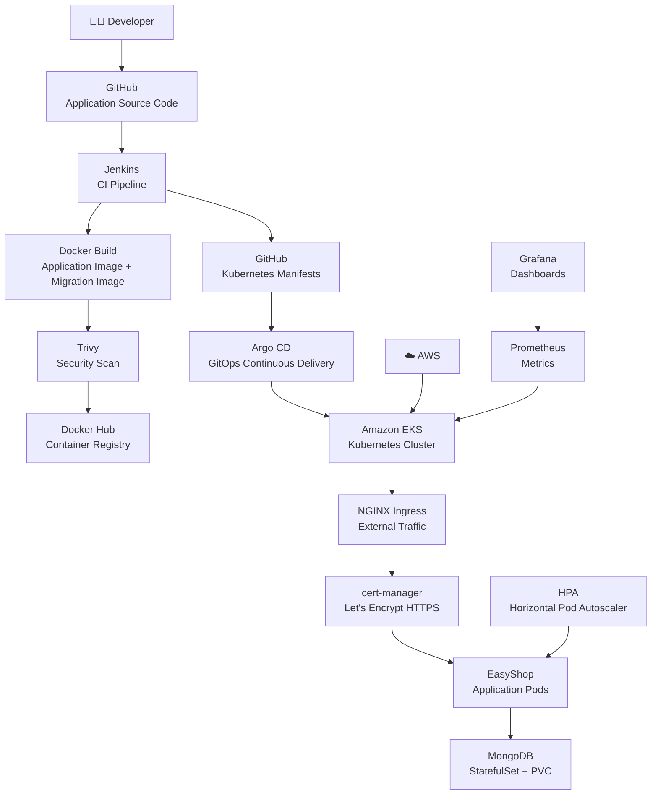

---

# 🔄 DevSecOps + GitOps Workflow

```text
Developer
    │
    ▼
GitHub
    │
    ▼
Jenkins CI
    │
    ├── Clone Repository
    │
    ├── Build Docker Images
    │
    ├── Trivy Security Scan
    │
    ├── Push Images to Docker Hub
    │
    └── Update Kubernetes Manifest Image Tag
             │
             ▼
       GitHub Kubernetes Manifests
             │
             ▼
          Argo CD
             │
             ▼
         AWS EKS
             │
      ┌──────┴───────┐
      ▼              ▼
 EasyShop          MongoDB
   Pods           StatefulSet
      │
      ▼
NGINX Ingress
      │
      ▼
HTTPS / Let's Encrypt
      │
      ▼
🌐 EasyShop Application
```

### GitOps principle used in this project

Jenkins performs the CI work and updates the Kubernetes manifests with the newly built image tag.

Argo CD continuously watches the Git repository and synchronizes the desired Kubernetes state with the EKS cluster.

This separates:

**CI → Jenkins**

from:

**CD/GitOps → Argo CD**

---

# 🧰 Technology Stack

| Category               | Technology                   |
| ---------------------- | ---------------------------- |
| Application            | Next.js 14                   |
| Language               | TypeScript                   |
| UI                     | React + Tailwind CSS         |
| State Management       | Redux                        |
| Database               | MongoDB                      |
| Source Control         | GitHub                       |
| Infrastructure as Code | Terraform                    |
| Cloud                  | AWS                          |
| Kubernetes             | Amazon EKS                   |
| Containerization       | Docker                       |
| CI                     | Jenkins                      |
| Security               | Trivy                        |
| Container Registry     | Docker Hub                   |
| GitOps / CD            | Argo CD                      |
| Ingress                | NGINX Ingress Controller     |
| TLS                    | cert-manager + Let's Encrypt |
| Autoscaling            | Kubernetes HPA               |
| Metrics                | Prometheus                   |
| Visualization          | Grafana                      |
| Package Manager        | Helm                         |

---

# ✨ Application Features

EasyShop provides a modern e-commerce experience with:

* 🛒 Shopping cart
* 🔐 Authentication
* 👤 User accounts
* 📦 Product categories
* 🔍 Product search and filtering
* 💳 Checkout functionality
* 📋 Order history
* 🌙 Dark / Light theme
* 📱 Responsive UI
* 🔄 Redux-based state management

---

# ☁️ AWS Infrastructure

Terraform is used to provision the infrastructure required for the project.

The infrastructure includes:

```text
AWS
│
├── VPC
│   ├── Public Subnets
│   ├── Private Subnets
│   └── Intra Subnets
│
├── NAT Gateway
│
├── DevOps / Jenkins EC2
│
└── Amazon EKS
    ├── Control Plane
    └── Managed Worker Nodes
```

The project uses the AWS region:

```text
ap-south-1
```

The EKS cluster is:

```text
easyshop-cluster
```
---

# 🚀 Deployment Guide

## 1. Prerequisites

Make sure the following are available:

* AWS account
* IAM permissions for required AWS resources
* Git
* Terraform
* AWS CLI
* kubectl
* Helm
* Docker
* Jenkins
* Docker Hub account

---

# 2. Clone the Repository

```bash
git clone https://github.com/snehalpawar29/EasyShop.git
cd EasyShop
```

---

# 3. Configure AWS CLI

Install AWS CLI if required and configure your credentials:

```bash
aws configure
```

Verify:

```bash
aws sts get-caller-identity
```

Set the AWS region:

```text
ap-south-1
```

> ⚠️ Never commit AWS access keys, secret keys, passwords, or tokens to GitHub.

---

# 4. Provision AWS Infrastructure with Terraform

Move into the Terraform directory:

```bash
cd terraform
```

Initialize Terraform:

```bash
terraform init
```

Validate the configuration:

```bash
terraform validate
```

Review the execution plan:

```bash
terraform plan
```

Apply the infrastructure:

```bash
terraform apply
```

Confirm with:

```text
yes
```

Terraform provisions the AWS networking, DevOps EC2 instance, and EKS infrastructure.

---

# 5. Verify Terraform Outputs

```bash
terraform output
```

Important outputs include:

```text
AWS Region
VPC ID
EKS Cluster Name
EKS Cluster Endpoint
DevOps EC2 Public IP
EKS Node Public IPs
```

---

# 6. Configure EKS kubeconfig

After the EKS cluster is created:

```bash
aws eks update-kubeconfig \
  --region ap-south-1 \
  --name easyshop-cluster
```

Verify the context:

```bash
kubectl config current-context
```

Check worker nodes:

```bash
kubectl get nodes
```

Expected:

```text
NAME                                             STATUS   ROLES
ip-10-0-...compute.internal                     Ready    <none>
ip-10-0-...compute.internal                     Ready    <none>
```

---

# 7. Automated DevOps Tool Installation

The repository contains:

```text
terraform/install_tools.sh
```

The bootstrap script installs and configures:

* Java 21
* Jenkins
* Docker
* Trivy
* AWS CLI
* Helm
* kubectl
* Argo CD CLI

It also enables Jenkins and Docker services.

The installation log is written to:

```text
/var/log/install-tools.log
```

Verify tools:

```bash
java -version
jenkins --version
docker --version
trivy --version
aws --version
helm version
kubectl version --client
argocd version --client
```

---

# 8. Jenkins Configuration

Check Jenkins:

```bash
sudo systemctl status jenkins
```

Get the initial administrator password if required:

```bash
sudo cat /var/lib/jenkins/secrets/initialAdminPassword
```

Access Jenkins through:

```text
http://<jenkins-public-ip>:8080
```

---

## Jenkins Credentials

Configure the required credentials under:

```text
Manage Jenkins
→ Credentials
→ Global
```

Create credentials for:

### GitHub

Used to clone the application repository and update Kubernetes manifests.

Example credential ID:

```text
github-credentials
```

### Docker Hub

Used to push application images.

Example:

```text
docker-hub-credentials
```

---

# 9. Jenkins Shared Library

The current Jenkinsfile uses:

```groovy
@Library('shared') _
```

Therefore Jenkins must have the corresponding **Global Pipeline Library** configured.

Go to:

```text
Manage Jenkins
→ System
→ Global Trusted Pipeline Libraries
```

Configure the shared library named:

```text
shared
```

The shared library provides pipeline functions used by the Jenkinsfile such as:

```text
clean_ws()
clone()
docker_build()
trivy_scan()
docker_push()
update_k8s_manifests()
```

---

# 10. Jenkins Pipeline

The current pipeline performs the following:

```text
Cleanup Workspace
        ↓
Clone GitHub Repository
        ↓
Build Application Image
        +
Build Migration Image
        ↓
Run Test Stage
        ↓
Trivy Security Scan
        ↓
Push Docker Images
        ↓
Update Kubernetes Manifests
```

The application image is:

```text
snehalpawar2945/easyshop
```

The migration image is:

```text
snehalpawar2945/easyshop-migration
```

Images are tagged using the Jenkins build number.

Example:

```text
snehalpawar2945/easyshop:25
snehalpawar2945/easyshop-migration:25
```

---

# 11. Docker Images

The project uses two Docker images.

### EasyShop Application

```text
snehalpawar2945/easyshop
```

Built using:

```text
Dockerfile
```

### Database Migration

```text
snehalpawar2945/easyshop-migration
```

Built using:

```text
scripts/Dockerfile.migration
```

The migration image is used by the Kubernetes migration Job.

---

# 12. DevSecOps Security Scan

Trivy is integrated into the Jenkins pipeline.

The security stage is:

```text
Build
  ↓
Trivy Scan
  ↓
Push Image
```

Trivy is used to identify vulnerabilities in the container/application build before images are pushed to Docker Hub.

Verify Trivy:

```bash
trivy --version
```

Example manual scan:

```bash
trivy image snehalpawar2945/easyshop:<TAG>
```

> **Note:** SonarQube is not part of the current EasyShop Jenkins pipeline. The implemented security scanning stage is Trivy.

---

# 13. Kubernetes Namespace

Create the application namespace:

```bash
kubectl apply -f kubernetes/namespace.yml
```

Verify:

```bash
kubectl get namespaces
```

The application namespace is:

```text
easyshop-ns
```

---

# 14. Deploy MongoDB

MongoDB is deployed using a Kubernetes StatefulSet.

Apply:

```bash
kubectl apply -f kubernetes/mongodb-pv.yml
kubectl apply -f kubernetes/mongodb-pvc.yml
kubectl apply -f kubernetes/mongodb-service.yml
kubectl apply -f kubernetes/mongodb-statefulset.yml
```

Verify:

```bash
kubectl get pods -n easyshop-ns
```

Check storage:

```bash
kubectl get pv
kubectl get pvc -n easyshop-ns
```

---

# 15. Run Database Migration

The project contains a dedicated Kubernetes migration Job.

Apply:

```bash
kubectl apply -f kubernetes/migration-job.yml
```

Check:

```bash
kubectl get jobs -n easyshop-ns
```

Check migration logs:

```bash
kubectl logs job/<migration-job-name> -n easyshop-ns
```

The migration image is maintained separately from the main application image.

---

# 16. Deploy EasyShop Application

Apply the application configuration:

```bash
kubectl apply -f kubernetes/configmap.yml
```

Apply the deployment:

```bash
kubectl apply -f kubernetes/easyshop-deployment.yml
```

Apply the service:

```bash
kubectl apply -f kubernetes/easyshop-service.yml
```

Verify:

```bash
kubectl get pods -n easyshop-ns
kubectl get svc -n easyshop-ns
```

---

# 17. Verify Kubernetes Resources

Check all resources:

```bash
kubectl get all -n easyshop-ns
```

Check pods:

```bash
kubectl get pods -n easyshop-ns -o wide
```

Check services:

```bash
kubectl get svc -n easyshop-ns
```

Check deployment:

```bash
kubectl get deployment -n easyshop-ns
```

---

# 18. Configure HPA

EasyShop uses Kubernetes Horizontal Pod Autoscaler.

Apply:

```bash
kubectl apply -f kubernetes/hpa.yml
```

Verify:

```bash
kubectl get hpa -n easyshop-ns
```

Check live metrics:

```bash
kubectl top pods -n easyshop-ns
```

Check nodes:

```bash
kubectl top nodes
```

HPA allows the application workload to scale according to resource utilization.

---

# 19. Install NGINX Ingress Controller

Create namespace:

```bash
kubectl create namespace ingress-nginx
```

Add the Helm repository:

```bash
helm repo add ingress-nginx https://kubernetes.github.io/ingress-nginx
helm repo update
```

Install:

```bash
helm install nginx-ingress ingress-nginx/ingress-nginx \
  --namespace ingress-nginx \
  --set controller.service.type=LoadBalancer
```

Verify:

```bash
kubectl get pods -n ingress-nginx
```

Check service:

```bash
kubectl get svc -n ingress-nginx
```

The LoadBalancer provides external access to the NGINX Ingress Controller.

---

# 20. Configure Application Ingress

Apply the EasyShop ingress:

```bash
kubectl apply -f kubernetes/ingress.yml
```

Verify:

```bash
kubectl get ingress -n easyshop-ns
```

Describe:

```bash
kubectl describe ingress easyshop-ingress -n easyshop-ns
```

The ingress routes external HTTP/HTTPS traffic to:

```text
easyshop-svc
```

---

# 21. Configure HTTPS with cert-manager

Add Jetstack repository:

```bash
helm repo add jetstack https://charts.jetstack.io
helm repo update
```

Install cert-manager:

```bash
helm install cert-manager jetstack/cert-manager \
  --namespace cert-manager \
  --create-namespace
```

Verify:

```bash
kubectl get pods -n cert-manager
```

The project contains:

```text
kubernetes/cluster-issuer.yml
```

Apply the ClusterIssuer:

```bash
kubectl apply -f kubernetes/cluster-issuer.yml
```

The Ingress references the Let's Encrypt issuer.

Apply:

```bash
kubectl apply -f kubernetes/ingress.yml
```

---

# 22. Verify TLS Certificate

Check certificates:

```bash
kubectl get certificate -n easyshop-ns
```

Check certificate details:

```bash
kubectl describe certificate -n easyshop-ns
```

Check TLS secret:

```bash
kubectl get secret -n easyshop-ns
```

The expected TLS secret is:

```text
easyshop-tls-secret
```

---

# 23. Configure DNS

Point the application domain to the NGINX LoadBalancer endpoint.

Verify the ingress LoadBalancer:

```bash
kubectl get svc -n ingress-nginx
```

Get the hostname:

```bash
kubectl get svc nginx-ingress-ingress-nginx-controller \
  -n ingress-nginx
```

After DNS propagation, verify:

```bash
nslookup <your-domain>
```

or:

```bash
dig <your-domain>
```

---

# 24. Verify HTTPS

Test the application:

```bash
curl -Iv https://<your-domain>
```

Verify the certificate:

```bash
openssl s_client \
  -connect <your-domain>:443 \
  -servername <your-domain>
```

The expected result is a valid Let's Encrypt certificate for the configured domain.

---

# 25. Install Argo CD

Create namespace:

```bash
kubectl create namespace argocd
```

Install Argo CD:

```bash
kubectl apply -n argocd \
  -f https://raw.githubusercontent.com/argoproj/argo-cd/stable/manifests/install.yaml
```

Verify:

```bash
kubectl get pods -n argocd
```

Wait until the Argo CD components are running.

---

# 26. Access Argo CD

Check services:

```bash
kubectl get svc -n argocd
```

If using NodePort:

```bash
kubectl patch svc argocd-server \
  -n argocd \
  -p '{"spec":{"type":"NodePort"}}'
```

Check the assigned NodePort:

```bash
kubectl get svc argocd-server -n argocd
```

Access:

```text
https://<worker-public-ip>:<nodeport>
```

---

# 27. Get Argo CD Admin Password

```bash
kubectl -n argocd get secret argocd-initial-admin-secret \
  -o jsonpath="{.data.password}" | base64 -d; echo
```

Default username:

```text
admin
```

After logging in, change the default password.

---

# 28. Configure Argo CD CLI

Verify:

```bash
argocd version --client
```

Login:

```bash
argocd login <argocd-host>:<port> \
  --username admin
```

Check clusters:

```bash
argocd cluster list
```

---

# 29. GitOps Application Configuration

Argo CD watches the Kubernetes manifests stored in GitHub.

Repository:

```text
https://github.com/snehalpawar29/EasyShop.git
```

Kubernetes manifests:

```text
kubernetes/
```

Application namespace:

```text
easyshop-ns
```

Configure the Argo CD application with:

```text
Application Name: easyshop
Project: default
Sync Policy: Automatic
Repository: EasyShop GitHub repository
Path: kubernetes
Destination: EKS cluster
Namespace: easyshop-ns
```

Once configured:

```text
GitHub
   ↓
Argo CD detects change
   ↓
Argo CD sync
   ↓
EKS
   ↓
Kubernetes resources updated
```

---

# 30. GitOps Deployment Flow

When Jenkins builds a new image:

```text
Jenkins Build #26
       ↓
Docker Image
       ↓
snehalpawar2945/easyshop:26
       ↓
Push Docker Hub
       ↓
Update Kubernetes Manifest
       ↓
GitHub
       ↓
Argo CD detects Git change
       ↓
Automatic Sync
       ↓
EKS
       ↓
New EasyShop Pods
```

This is the core **GitOps deployment workflow** of the project.

---

# 📊 Monitoring with Prometheus & Grafana

Prometheus and Grafana are installed using Helm.

---

## 31. Install Helm

Verify:

```bash
helm version
```

---

## 32. Add Prometheus Repository

```bash
helm repo add prometheus-community \
  https://prometheus-community.github.io/helm-charts
```

Update:

```bash
helm repo update
```

---

# 33. Create Monitoring Namespace

```bash
kubectl create namespace monitoring
```

---

# 34. Install kube-prometheus-stack

```bash
helm install kube-prometheus-stack \
  prometheus-community/kube-prometheus-stack \
  -n monitoring
```

Verify:

```bash
kubectl get pods -n monitoring
```

You should see components such as:

```text
Prometheus
Grafana
Alertmanager
Node Exporter
kube-state-metrics
```

---

# 35. Check Monitoring Services

```bash
kubectl get svc -n monitoring
```

Check Prometheus:

```bash
kubectl get svc -n monitoring | grep prometheus
```

Check Grafana:

```bash
kubectl get svc -n monitoring | grep grafana
```

---

# 36. Access Grafana

If required, expose Grafana using NodePort:

```bash
kubectl patch svc kube-prometheus-stack-grafana \
  -n monitoring \
  -p '{"spec":{"type":"NodePort"}}'
```

Check:

```bash
kubectl get svc -n monitoring
```

Access:

```text
http://<worker-public-ip>:<grafana-nodeport>
```

---

# 37. Get Grafana Password

```bash
kubectl get secret \
  kube-prometheus-stack-grafana \
  -n monitoring \
  -o jsonpath="{.data.admin-password}" | base64 -d; echo
```

Default username:

```text
admin
```

---

# 38. Prometheus

Access Prometheus through its configured service/NodePort.

Useful verification:

```bash
kubectl get pods -n monitoring
```

Prometheus is responsible for collecting Kubernetes and workload metrics.

---

# 39. Grafana Dashboards

Recommended dashboards for this project include:

### Kubernetes Nodes

Monitor:

* CPU
* Memory
* Node availability
* Resource utilization

### Kubernetes Pods

Monitor:

* Pod CPU
* Pod memory
* Pod status
* Workload behavior

### Kubernetes Workloads

Monitor:

* Deployments
* Replica counts
* Resource consumption
* Workload health

### Node Exporter

Monitor:

* Node-level system metrics
* CPU
* Memory
* Filesystem
* Network metrics

---

# 📈 Monitoring Architecture

```text
                    Kubernetes Cluster
                           │
              ┌────────────┴────────────┐
              │                         │
         kube-state-metrics        Node Exporter
              │                         │
              └────────────┬────────────┘
                           ▼
                      Prometheus
                           │
                           ▼
                        Grafana
                           │
                           ▼
                  Kubernetes Dashboards
```

---

# 🖼️ Project Screenshots

The repository contains deployment and monitoring screenshots under:

```text
docs/screenshots/
```

## AWS

### VPC

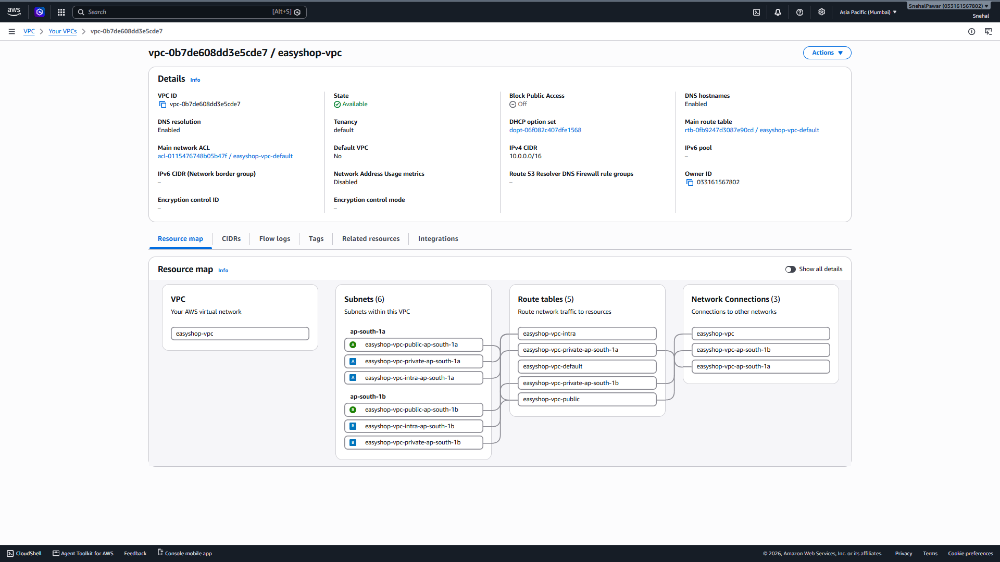

### EKS Cluster

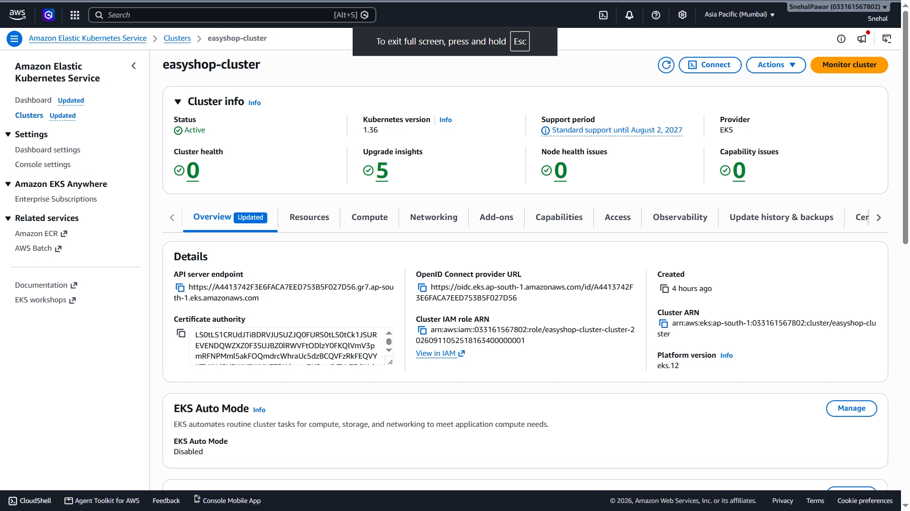

### EKS Nodes


---

## Jenkins

### Jenkins Dashboard


### Jenkins Pipeline Stages

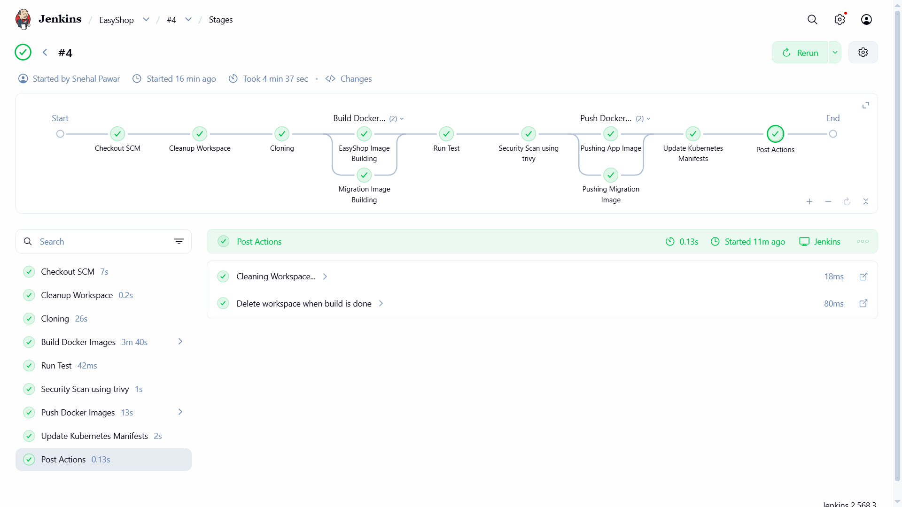

### Successful Jenkins Pipeline


---

## Docker Hub

### EasyShop Image

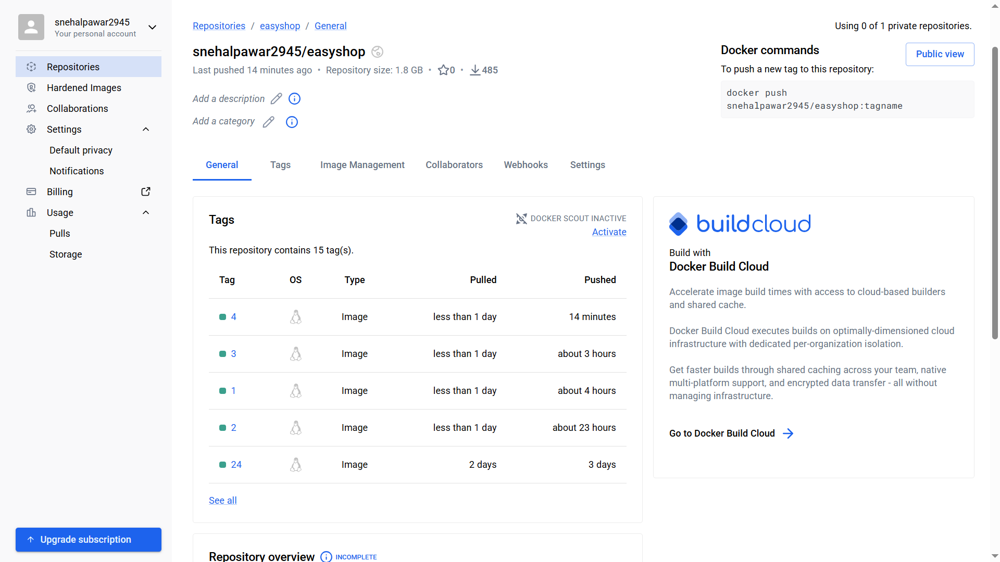

### Migration Image

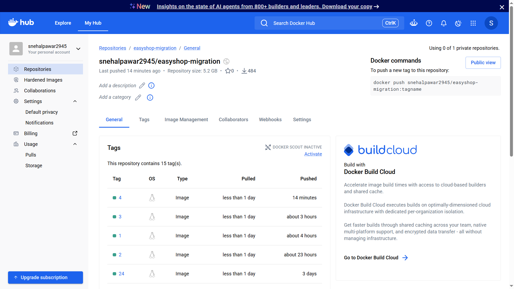

---

## Kubernetes

### Nodes


### EasyShop Pods

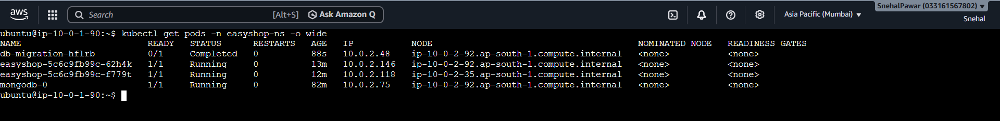

### Services


### All Resources


---

## Argo CD

### Argo CD Application


### Argo CD Resource Tree

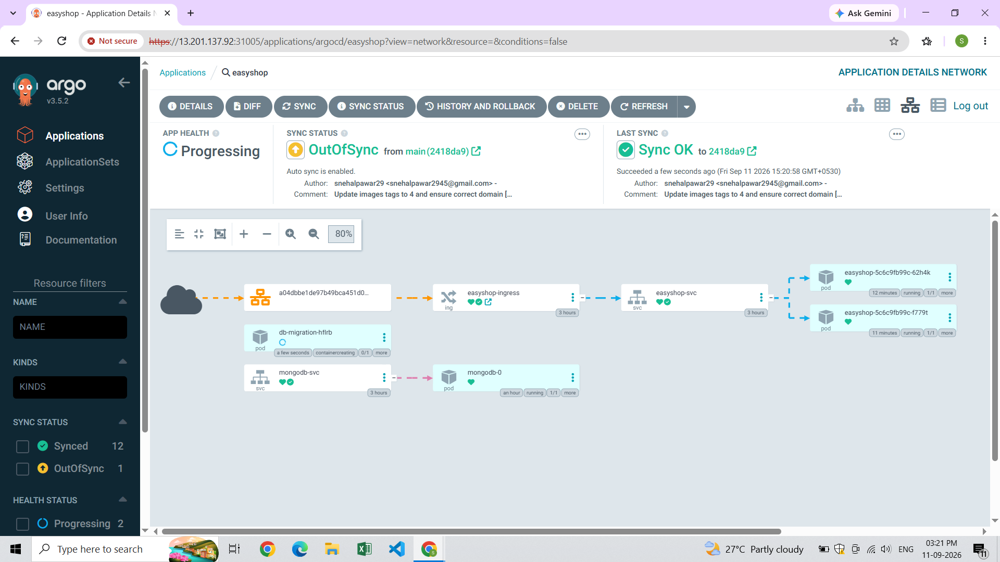

---

## Security & HTTPS

### Let's Encrypt Certificate

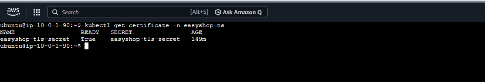

### HTTPS Domain


### NGINX Ingress

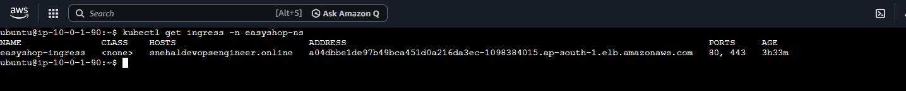

---

## HPA

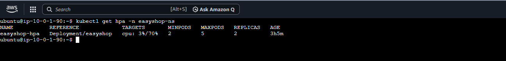

---

## Prometheus

### Prometheus Overview

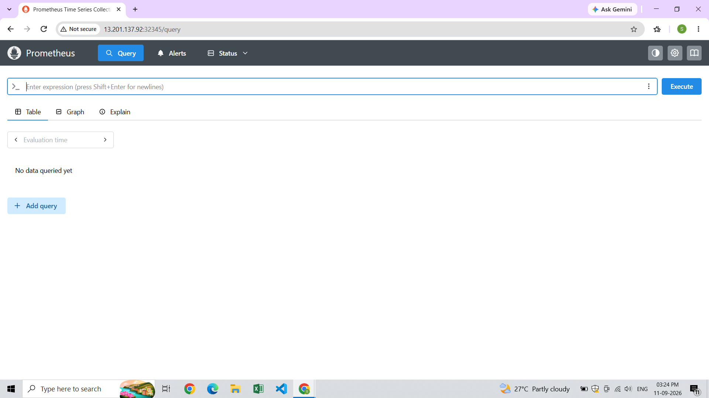

### Prometheus Targets


---

## Grafana

### Kubernetes Nodes

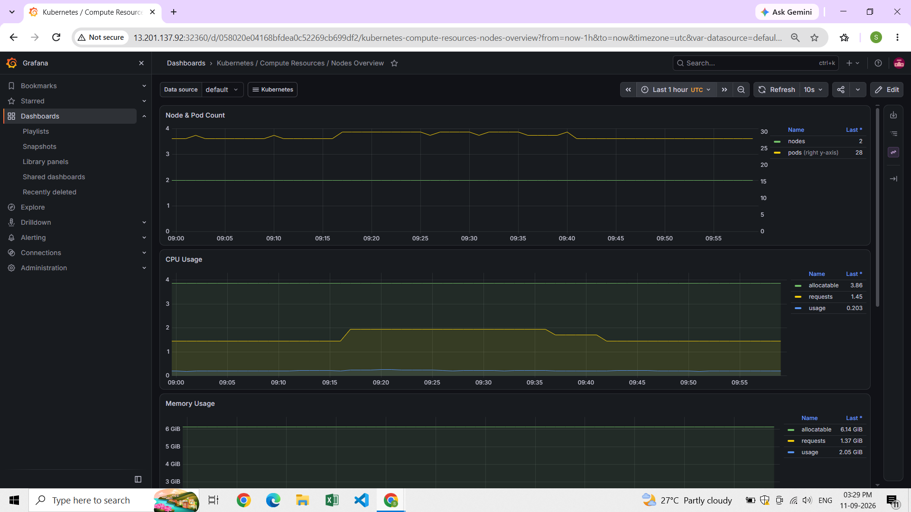

### Kubernetes Pods

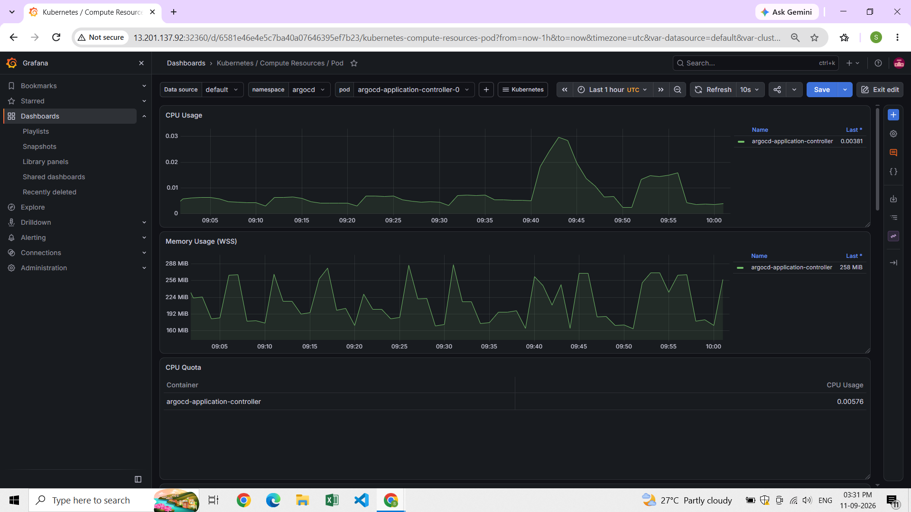

### Kubernetes Workloads


### Node Exporter

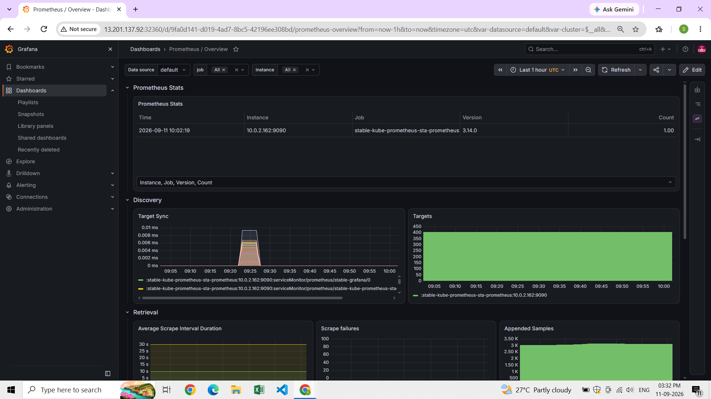

---

## 🚀 Application


---

# 🔐 Security Practices

This project implements security at multiple stages.

### Source / Build Stage

* GitHub source control
* Jenkins pipeline
* Trivy security scanning

### Container Stage

* Docker image scanning
* Versioned Docker image tags
* Separate migration image

### Kubernetes Stage

* Kubernetes Secrets
* Namespaces
* Resource management
* HPA
* Ingress
* TLS certificates

### Network Stage

* AWS VPC
* Security Groups
* NGINX Ingress
* HTTPS

> **Important:** Secrets and credentials should be supplied through secure secret-management mechanisms and should never be committed to a public repository.

---

# 📁 Important Project Files

| File / Directory                     | Purpose                      |
| ------------------------------------ | ---------------------------- |
| `terraform/`                         | AWS infrastructure           |
| `terraform/vpc.tf`                   | VPC and subnet configuration |
| `terraform/eks.tf`                   | EKS cluster and node groups  |
| `terraform/ec2.tf`                   | DevOps EC2                   |
| `terraform/install_tools.sh`         | DevOps tool bootstrap        |
| `Jenkinsfile`                        | CI pipeline                  |
| `Dockerfile`                         | EasyShop container image     |
| `scripts/Dockerfile.migration`       | Migration container          |
| `kubernetes/`                        | Kubernetes manifests         |
| `kubernetes/easyshop-deployment.yml` | Application deployment       |
| `kubernetes/easyshop-service.yml`    | Application service          |
| `kubernetes/migration-job.yml`       | Database migration           |
| `kubernetes/mongodb-statefulset.yml` | MongoDB                      |
| `kubernetes/hpa.yml`                 | Autoscaling                  |
| `kubernetes/ingress.yml`             | External routing             |
| `kubernetes/cluster-issuer.yml`      | Let's Encrypt                |
| `docs/screenshots/`                  | Project evidence             |

---

# 🧪 Useful Kubernetes Commands

Check everything:

```bash
kubectl get all -n easyshop-ns
```

Check pods:

```bash
kubectl get pods -n easyshop-ns -o wide
```

Check services:

```bash
kubectl get svc -n easyshop-ns
```

Check ingress:

```bash
kubectl get ingress -n easyshop-ns
```

Check HPA:

```bash
kubectl get hpa -n easyshop-ns
```

Check metrics:

```bash
kubectl top nodes
kubectl top pods -n easyshop-ns
```

Check certificates:

```bash
kubectl get certificate -n easyshop-ns
```

Check Argo CD:

```bash
kubectl get pods -n argocd
```

Check monitoring:

```bash
kubectl get pods -n monitoring
```

---

# 🧹 Cleanup

Before destroying infrastructure, make sure application resources and external AWS resources are no longer required.

Destroy Terraform-managed infrastructure:

```bash
cd terraform
terraform destroy
```

Confirm:

```text
yes
```

> ⚠️ **Warning:** `terraform destroy` deletes Terraform-managed AWS infrastructure. Review the plan carefully before confirming.

---

# 📚 What I Learned From This Project

This project provided hands-on experience with:

* AWS VPC design
* Terraform Infrastructure as Code
* Amazon EKS
* Kubernetes deployments and services
* Stateful workloads
* Persistent storage
* Docker multi-stage builds
* Jenkins CI pipelines
* Docker Hub
* Trivy security scanning
* GitOps with Argo CD
* NGINX Ingress
* TLS automation with cert-manager
* Let's Encrypt
* Kubernetes HPA
* Prometheus
* Grafana
* Helm
* Kubernetes troubleshooting
* CI/CD automation
* Cloud infrastructure troubleshooting

---

# 🎯 DevOps Skills Demonstrated

```text
Cloud
├── AWS
├── VPC
├── EC2
└── EKS

Infrastructure as Code
└── Terraform

CI/CD
└── Jenkins

Security
└── Trivy

Containers
├── Docker
└── Docker Hub

Orchestration
└── Kubernetes

GitOps
└── Argo CD

Networking
├── NGINX Ingress
├── LoadBalancer
└── DNS

TLS
├── cert-manager
└── Let's Encrypt

Scaling
└── HPA

Observability
├── Prometheus
└── Grafana
```

---

# 💼 Resume-Ready Project Description

> **EasyShop – End-to-End DevSecOps & GitOps E-Commerce Platform on AWS EKS**
> Designed and deployed a production-grade e-commerce application on AWS EKS using Terraform, Docker, Jenkins, Trivy, Kubernetes and Argo CD. Implemented automated CI/CD, container image security scanning, GitOps-based deployment, NGINX Ingress, HTTPS using Let's Encrypt, Kubernetes HPA, and Prometheus/Grafana monitoring.

---

# 🗣️ Interview Explanation

### How does your deployment work?

> A developer pushes code to GitHub. Jenkins pulls the latest source code, builds the EasyShop and database migration Docker images, performs a Trivy security scan, and pushes versioned images to Docker Hub. Jenkins then updates the Kubernetes manifests with the new image tag and commits the change back to GitHub. Argo CD detects the Git change and synchronizes the desired state to the AWS EKS cluster. NGINX Ingress exposes the application externally, cert-manager provides HTTPS through Let's Encrypt, HPA handles application scaling, and Prometheus with Grafana provides monitoring and observability.

---

# 🔮 Future Improvements

The current implementation can be extended with:

* AWS Secrets Manager / External Secrets
* Amazon RDS / DocumentDB for managed database workloads
* Private EKS worker nodes
* AWS Load Balancer Controller
* Network Policies
* Centralized logging
* Alertmanager notifications
* Automated integration testing
* SonarQube / SAST integration
* Dependency vulnerability scanning
* Image signing and verification
* Blue/Green deployments
* Canary deployments
* Disaster recovery
* Automated backups
* Multi-environment Terraform modules

---

# ⭐ Project Highlights

```text
🏗️ Infrastructure as Code
☁️ AWS EKS
🐳 Docker
🔄 Jenkins CI/CD
🔐 Trivy Security
🚀 Argo CD GitOps
☸️ Kubernetes
🌐 NGINX Ingress
🔒 Let's Encrypt HTTPS
📈 HPA
📊 Prometheus
📉 Grafana
🗄️ MongoDB
```

---

# 👨‍💻 Author

**Snehal Pawar**

Aspiring DevOps Engineer

GitHub:
https://github.com/snehalpawar29

---

# 📜 License

This project is licensed under the MIT License.
